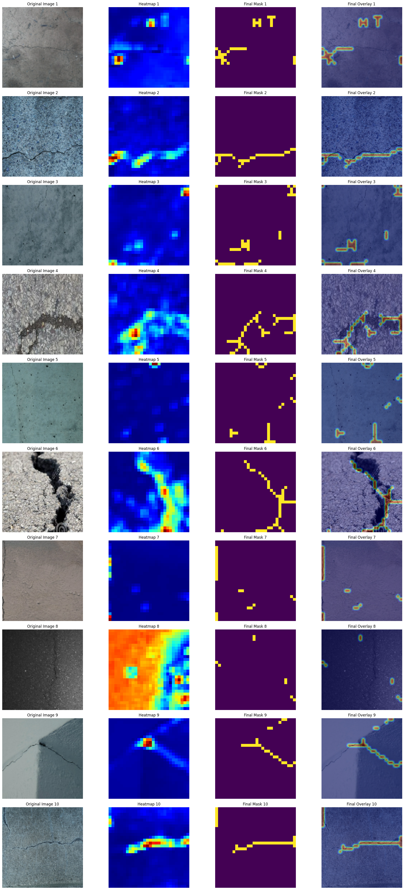

# Road Crack Segmentation Without Mask
## Authors: addobosz, [Wector1](https://github.com/Wector1/)

This project aims to create crack maps in an unsupervised way using various deep learning models, focusing mostly on the GradCAM technique and its variants. The dataset used for this project is the Crack Segmentation Dataset from Kaggle.

## Table of Contents

- Data Preparation
- Data Augmentation
- Inspect the Dataset
- Class Imbalance
- Model Training
- Grad-CAM
- Grad-CAM++
- UP-CrackNet
- Results

## Data Preparation

The dataset is split into training and testing sets. The images are labeled as crack or non-crack based on their filenames. The data is then split into training, validation, and test sets.

## Data Augmentation

To enhance the dataset, synthetic images are created by applying random 90-degree rotations, followed by optional horizontal and vertical flips. This doubles the amount of training data while maintaining high variability.

## Inspect the Dataset

### Check the Images

Visualize some images from the training dataset to inspect the data.

### Check for Class Imbalance

Check the percentage of crack and non-crack images in the training set to identify any class imbalance.

## Model Training

A performant classifier is needed to create activation maps for the gradcam method.
For this purpose, several models are tested: a simple CNN, VGG-16, and ResNet50. The function `create_model` handles the creation of different models. Each model is trained and evaluated on the dataset. These classifiers are necessary for generating Grad-CAM visualizations.

### Simple CNN

A straightforward CNN model trained on a relatively small number of epochs, achieving remarkable results.

### VGG-16

VGG-16 with basic fine-tuning achieved astounding performance after only a few epochs of training.

### ResNet

ResNet's performance was inferior to its predecessors, given the same training data and number of epochs.

## Grad-CAM

Grad-CAM (Gradient-weighted Class Activation Mapping) is a visualization technique that helps interpret decisions made by deep convolutional neural networks (CNNs). It produces a heatmap highlighting important regions of an input image for a specific class prediction.

### Grad-CAM Algorithm

1. Identify the Target Layer
2. Compute Gradients
3. Weight Averaging
4. Weighted Sum
5. ReLU Activation

## Grad-CAM++

Grad-CAM++ is an extension of the Grad-CAM algorithm that improves visual explanations for convolutional neural networks (CNNs). It addresses the limitations of Grad-CAM, particularly in handling images with multiple occurrences of the same class and poor localization of objects in single-object images.

## Postprocessing of the obtained maps
Postprocessing is a vital step to refine the crack maps generated by the models. This involves:

Thresholding: Convert the grayscale output images into binary masks to highlight crack regions.
Morphological Operations: Apply operations like dilation and erosion to remove noise and small artifacts from the binary masks.
Skeletonization: Identify connected regions in the binary masks to isolate individual cracks.

### Key Enhancements in Grad-CAM++

1. Pixel-wise Weighting of Gradients
2. Higher-Order Gradients
3. Closed-Form Solution
4. ReLU Activation

## Results

## Drawbacks of the approach
1. **Vanishing gradient**

As you can see in the picture below, our model sometimes may have problems with displaying heatmaps of atypical images. It seems that this issue is due to the **vanishing gradient** effect. 

How does this affect the GradCAM++ algorithm?

- Weakened First-Order Gradients (most likely the case here): 

Grad-CAM++ uses first-, second-, and third-order gradients to calculate pixel-wise importance weights. If the gradients are too small, the computed weights (alpha_weights) may become negligible, resulting in heatmaps with little to no activation (e.g., all-black heatmaps).

- Reduced Sensitivity in Deeper Layers:

In very deep networks, vanishing gradients can cause Grad-CAM++ to fail at capturing meaningful activations in deeper layers, as the contributions from those layers diminish. This was the issue when trying to extract heatmaps from ResNet which has plenty of layers.

- Noise Amplification in Higher-Order Gradients:

When gradients are already weak, the computation of second- and third-order gradients can amplify numerical instability or noise, further degrading the quality of the heatmap.

2. **Higher Computational Cost**

- Grad-CAM++ involves the computation of second- and third-order gradients, which increases computational complexity compared to Grad-CAM.
- May be slower on large models or datasets.

3. **Susceptibility to Noise**

- The reliance on higher-order gradients can make Grad-CAM++ sensitive to small variations in the feature maps or class scores, leading to noisy heatmaps in some cases.

4. **Potential Overemphasis**

- The method can sometimes over-highlight regions due to pixel-wise weighting, potentially attributing importance to irrelevant areas if the higher-order gradients are misleading.

## UP-CrackNet

UP-CrackNet is an unsupervised pixel-wise road crack detection framework leveraging adversarial image restoration. Unlike supervised approaches requiring extensive annotated datasets, UP-CrackNet trains only on undamaged road images to perform crack detection.

### Summary of UP-CrackNet

1. Random Corruption of Images
2. Adversarial Image Restoration
3. Testing Phase
4. Loss Functions

### Our Contribution

- Dataset preprocessing to take fragments without cracks.
- Adjusting the path structure.
- Testing different architecture parameters.
- Changing the resultant grayscale images into binary masks to compare them with our dataset's format.

## Results

The results of the models and Grad-CAM visualizations are presented, showing the effectiveness of the models in detecting road cracks and generating crack maps.